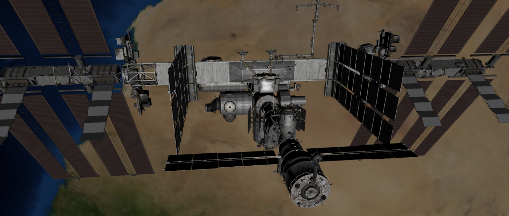

libqtr3d - Cuter 3D with Qt
==========================
Target is to provide a simple Qt/C++ 3D Interface. Life's too short to learn shaders. And Qt3D has (IMHO) too much overhead. Qt delivers everything you need (QOpenGLWidget, QOpenGLShader). Why not having just a KISS-Interface for simple 3D-Apps?

- [x] Hello world in just a few lines of code.
- [x] Just Qt, OpenGL and C++. No extra dependencies.
- [x] Class-Library. Just include the profile. Step through the code.
- [ ] API unstable! Work in progress...




First steps (after installing Qt)
---------------------------------
```
$ git clone https://github.com/solarix95/libqtr3d.git
$ cd libqtr3d
$ cd examples
$ ./runall.sh
$ cd ../apps/qtr3dviewer && qmake && make && ./qtr3dviewer
```

Project Roadmap
---------------------------------

| Version       | Features      | Status|
| ------------- |:-------------:| -----:|
| 0.1           | static models, simple lighting, camera control, native GLB-Loader, basic animations | <wip> |
| 0.2           | multiple lights, shadows | <open> |
| 0.3           | Skeletal animation       | <open> |

